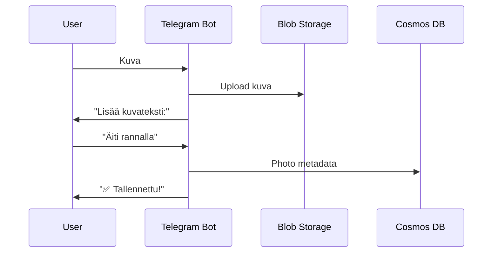
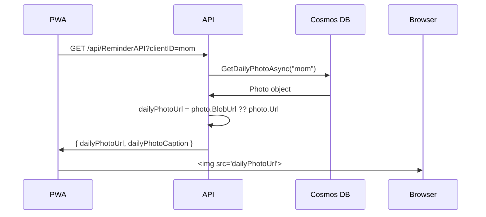

# Valokuvien Arkkitehtuuri 📸

## Yleiskatsaus

ReminderApp tukee valokuvia **kolmesta eri lähteestä**:

1. **Google Drive** (nykyinen)
2. **Azure Blob Storage** (tuleva)
3. **Telegram** (tuleva)

## Photo-malli

```json
{
  "id": "photo_mom_001",
  "clientId": "mom",
  "type": "photo",
  
  // URL-kentät (prioriteetti järjestyksessä)
  "blobUrl": "",           // #1 Azure Blob Storage (korkein prioriteetti)
  "url": "https://...",    // #2 Google Drive tai muu URL
  "thumbnailUrl": "",      // Pikkukuva (valinnainen)
  
  // Metadata
  "caption": "Äiti, Petri ja Tiitta",
  "fileName": "photo_001.jpg",
  "fileSize": 1024000,
  "mimeType": "image/jpeg",
  
  // Lähdetiedot
  "source": "google-drive",  // "google-drive" | "blob-storage" | "telegram"
  "uploadSource": "google_drive",
  "uploadedBy": "petri",
  "uploadedAt": "2025-09-30T10:00:00Z",
  "createdAt": "2025-09-30T10:00:00Z",
  
  // Telegram-spesifit kentät
  "telegramFileId": null,
  "senderName": null,
  "senderChatId": null,
  
  // Hallinta
  "isActive": true,
  "tags": ["family", "memories"]
}
```

## API:n URL-prioriteetti

```csharp
// ReminderApi.cs line 113
var dailyPhotoUrl = photo?.BlobUrl ?? photo?.Url ?? string.Empty;
```

**Prioriteettijärjestys:**
1. `blobUrl` (Azure Blob Storage - nopein, luotettavin)
2. `url` (Google Drive tai muu)
3. Tyhjä string (ei kuvaa)

## Lähteiden tuki

### 1. Google Drive ✅ (Nykyinen)

**Edut:**
- Ilmainen
- Helppo jakaa linkkejä
- Ei vaadi Azure-resursseja

**Haitat:**
- Hitaampi kuin Blob Storage
- Riippuvainen Google-palvelusta
- Thumbnail-linkit saattavat vanhentua

**Käyttö:**
```powershell
.\create-mom-photos.ps1
# Luo 26 JSON-tiedostoa Google Drive -linkkeillä
# Lisää manuaalisesti Cosmos DB:hen
```

### 2. Azure Blob Storage 🚧 (Tuleva)

**Edut:**
- Nopea (sama datacenter kuin API)
- Luotettava
- CDN-tuki mahdollinen
- Helppo hallinta (SAS tokens)

**Haitat:**
- Maksullinen (~$0.02/GB/kk)
- Vaatii Azure Storage Accountin
- Monimutkaisempi setup

**Suunnitelma:**
```powershell
# 1. Luo Storage Account
.\setup-blob-storage.ps1

# 2. Lataa kuvat
.\upload-photos-to-blob.ps1

# 3. Päivitä Cosmos DB
# Photo-dokumentit saavat blobUrl-kentän
```

### 3. Telegram 🔮 (Tuleva)

**Edut:**
- Omaiset voivat lähettää kuvia suoraan chatissa
- Ei vaadi teknistä osaamista
- Automaattinen synkronointi

**Haitat:**
- Vaatii Telegram Bot -integraation
- Telegram API -rajoitukset
- Caption täytyy kysyä erikseen

**Suunnitelma:**
1. Omainen lähettää kuvan Telegram-bottiin
2. Botti lataa kuvan Blob Storageen
3. Botti kysyy captionia
4. Botti tallentaa metadata Cosmos DB:hen:
   ```json
   {
     "source": "telegram",
     "blobUrl": "https://...",
     "telegramFileId": "AgACAgIAAxkBAAI...",
     "senderName": "Petri Pehkonen",
     "senderChatId": "123456789",
     "caption": "Reissussa Lapissa"
   }
   ```

## Päivittäisen kuvan valinta

```csharp
// CosmosDbService.cs GetDailyPhotoAsync()
var photoIndex = DateTime.Now.Day % photos.Count;
return photos[photoIndex];
```

**Logiikka:**
- Kuukauden päivä (1-31) määrittää indeksin
- Esim. 26 kuvaa → päivä 30 → indeksi 4 (30 % 26 = 4)
- Sama kuva näkyy samana päivänä joka kuukausi

## Migration Google Drive → Blob Storage

Kun siirrytään Blob Storageen:

```powershell
# 1. Lataa kaikki Google Drive -kuvat
.\download-from-google-drive.ps1

# 2. Lataa Blob Storageen
.\upload-photos-to-blob.ps1

# 3. Päivitä Cosmos DB
# Lisää blobUrl, säilytä url fallbackina
UPDATE Photos SET blobUrl = 'https://...' WHERE source = 'google-drive'
```

**Vaihtoehtoisesti:**
- Säilytä Google Drive -linkit `url`-kentässä
- Lisää uudet kuvat Blob Storageen
- API käyttää automaattisesti `blobUrl`:ia jos saatavilla

## Tietoturva

### Google Drive
- Julkiset linkit (kuka tahansa voi katsoa)
- ⚠️ Ei sovellu arkaluonteisille kuville

### Blob Storage
- Private containers + SAS tokens
- Vain API voi generoida katselulinkkejä
- SAS token vanhentuu (esim. 1h)
- ✅ Turvallinen

### Telegram
- Kuvat tallennetaan Blob Storageen
- Metadata sisältää lähettäjän tiedot
- Vain valtuutetut käyttäjät voivat lähettää

## Kustannukset

| Lähde | Kustannus | Kommentti |
|-------|-----------|-----------|
| Google Drive | Ilmainen | 15GB rajaan asti |
| Azure Blob Storage | ~$0.50/kk | 100 kuvaa (~25GB) + transactions |
| Telegram | Ilmainen | Mutta vaatii Blob Storagen |

## Seuraavat askeleet

### Lyhyt aikaväli (viikko 1-2)
1. ✅ Lisää mom:n Google Drive -kuvat Cosmos DB:hen
2. ⏳ Testaa API:n kuvanäyttö
3. ⏳ Varmista kuva-rotaatio toimii

### Keskipitkä aikaväli (viikko 3-4)
1. ⏳ Luo Azure Blob Storage
2. ⏳ Migroi kuvat Google Drive → Blob
3. ⏳ Testaa molemmat lähteet rinnakkain

### Pitkä aikaväli (kuukausi 2+)
1. ⏳ Telegram Bot -integraatio
2. ⏳ Kuvan lähetys Telegramista
3. ⏳ Automaattinen caption-kysely
4. ⏳ Multi-tenant: jokaiselle clientille omat kuvat

## Käyttöohjeet

### Mom:n kuvien lisäys NYT (Google Drive)

```powershell
# 1. Luo JSON-tiedostot
.\create-mom-photos.ps1

# 2. Avaa Azure Portal
# https://portal.azure.com

# 3. Cosmos DB → ReminderAppDB → Photos → Items

# 4. New Item → Kopioi photo-mom-001.json → Save

# 5. Toista kaikille 26 kuvalle (photo-mom-002.json ... photo-mom-026.json)

# 6. Testaa
Invoke-RestMethod -Uri "https://reminderapp-functions-hrhddjfeb0bpa0ee.swedencentral-01.azurewebsites.net/api/ReminderAPI?clientID=mom" | Select-Object dailyPhotoUrl, dailyPhotoCaption
```

### Telegram-lähetys TULEVAISUUDESSA

```
1. Avaa Telegram
2. Etsi @ReminderAppBot
3. Lähetä kuva
4. Bot kysyy: "Lisää kuvateksti:"
5. Vastaa: "Äiti ja Petri rannalla"
6. Bot: "✅ Kuva tallennettu!"
7. Kuva näkyy seuraavana päivänä rotaatiossa
```

## Tekninen toteutus

### Photo Upload Flow (Telegram)



### API Photo Fetch Flow



## Yhteenveto

✅ **Nykyinen:** Google Drive -linkit (`url`)  
🚧 **Tuleva:** Azure Blob Storage (`blobUrl`)  
🔮 **Visio:** Telegram-integraatio (`telegramFileId` + `blobUrl`)

API tukee jo kaikkia kolmea! 🎉
